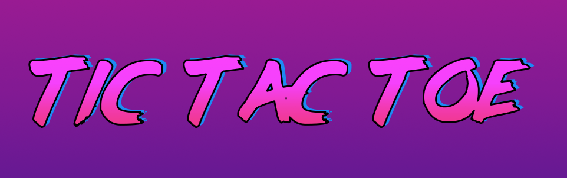
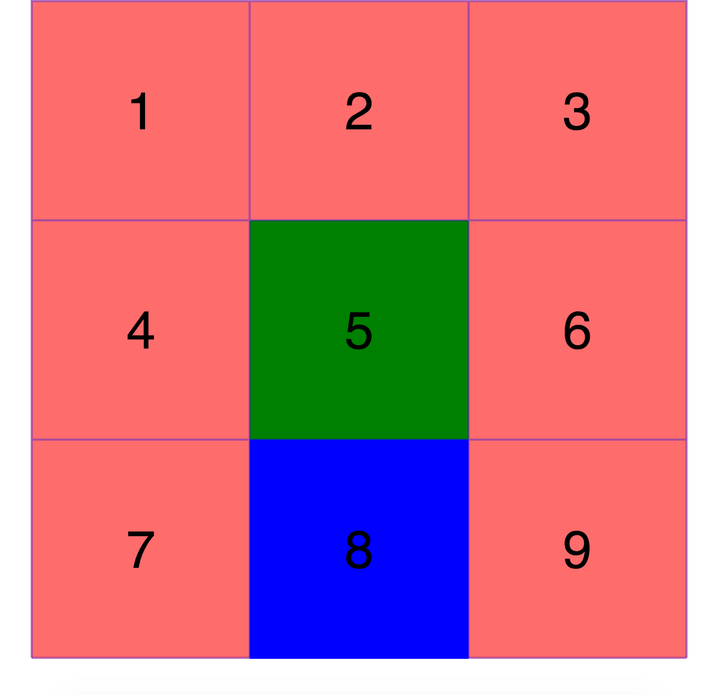

# Tic Tac Toe - 80s edition

This project was coded in HTML, CSS and jQuery 3.3.1

**How I approached this project**

Tic Tac Toe is a simple game to play, so it should be easy to program, right? Nope. There are a lot of small considerations when trying to build this game. Even without an AI playing against the user. 

If you count the winning combinations on your fingers, you'll probably end up around 8. 3x Vertical + 3x Horisontal + 2 diagonal each way.  When you tell a computer this, it will take your rules literally and not take into account which sequences the winning combinations are made in. I found that out pretty late in my project. 

Early in the planning process I decided that I would focus less on building a bulletproof game, and focus more on DOM manipulation with jQuery and creating a game that looks good and uses some advanced CSS tricks. 

jQuery is a pleasure to work with. The amount of code ends up being a lot less then writing 'pure' JavaScript and for a project of this size, speed and file sizes aren't my biggest concern. 

 **Lessons I've learned **

- I need to sketch my thoughs out to better understand them. 
- A algorithm flow-chart confused me more than gave me answers in this project - even though I made it myself. I scrapped that tool in this project but will give it another go in the next.
- I like building a quick prototype, so get ideas for layout and interaction. See below
- There are so many great answers on Internet for any kind of question you can ask in coding, but it takes a bit of insight to recognize how smart they are. I found several code snippets on StackOverflow that would solve my problem. Often I liked the thought-process behind, but not the actual code - it would help me write my own solution, with their idea in mind. I've copy/pasted too much code in the past, and don't want to do that again. 
- CSS3 Animations and transitions are the business. Everyone should learn them. There are many great tools that can help with syntax and vendor prefixes. 
  I used [ColorZilla]( http://www.colorzilla.com/gradient-editor/) help me make the gradients from my photoshop mock-up into CSS3 code.
- If I am copy/pasting code that does the same thing more than twice, I will try to build a function. I'm still not  completely comfortable with building function that take arguments, but I've managed to build a few in this project. (Shout out to Kasun and DT for the help!)

**What I need to work on personally**

I need to learn to structure my JavaScript code better and make it easier to read. I've had to re-read my code a few times after leaving it for a few hours. 

I also need to learn to break down problems in atomic parts to really gain a full understanding in what's happening in the compiler. Often I focus on getting it to work as fast as possible, instead of trying to understand my code on a basic level and focus on getting it to work as fast as possible.

**Bugs and Unsolved Issues**

- Game does not consider 'Draw' scenarios.

- Games does not reset on win.

- Game is using a lot of fixed dimensions and is not responsive at all. 

  ​

**TO-DO List**

- Re-read complicated code sections, i.e Regex expressions in functions
- Redesign X & O symbols
- Keep score of winning
- Add input fields to get player names
- Show player turn (could be a toggleClass based on turnCounter)
- Give players avatar options
- Fix bugs and refactor code